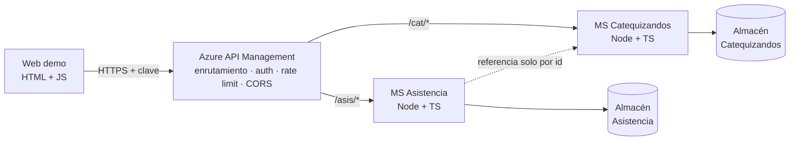

# SIGECAT — Tarea 2: Demo con API Management y Microservicios

> **Este archivo es el contrato del equipo.** Va en la raíz del repositorio de la Tarea 2. Cada integrante se lo pasa a su agente (Claude Code) antes de pedirle código. Si algo no está aquí, se pregunta en el grupo antes de inventarlo: si cada agente improvisa su propia API, la integración falla al final.

> **Regla de oro:** el vocabulario y las formas de datos salen de `src/lib/domain/modelo.ts` del repositorio principal (`anycodef/proyecto-taller-aplicaciones-sociales`). Los microservicios hablan el mismo lenguaje ubicuo que SIGECAT. Cualquier diferencia con ese archivo está marcada aquí como **[PROPUESTA]**.

---

## 0. Qué exige la tarea

- [ ] 2 microservicios con buenas prácticas SOLID y DDD, **con sustentación escrita**
- [ ] Una plataforma de API Management en la nube
- [ ] Una web que llame **al menos 2 APIs a través del APIM**
- [ ] API Gateway configurado con **al menos 3 características**
- [ ] Demo funcional + **diagrama de arquitectura**

---

## 1. Decisiones ya tomadas

| Tema | Decisión | Por qué |
|---|---|---|
| Repositorio | **Repo nuevo y separado** del proyecto principal | El `tsconfig.json` del repo principal incluye `**/*.ts` sobre la base de Expo: código Express dentro de ese repo rompería `npm run typecheck` del proyecto del otro curso |
| Microservicio 1 | **Catequizandos** — grupos y catequizandos | Contexto acotado de nuestro C3 |
| Microservicio 2 | **Asistencia** — sesiones, registros y señal de riesgo | Contexto acotado de nuestro C3 |
| Relación entre ambos | Asistencia guarda solo `catequizandoId` y `grupoId`. **No se llaman entre sí.** La web compone ambos | DDD: entre contextos se referencia por identidad. Sin acoplamiento distribuido |
| Lenguaje | Node.js 20 + TypeScript + Express | Coherente con el ADR 004 |
| Datos | Almacén propio por servicio. Repositorio en memoria con semilla (obligatorio), SQLite (deseable) | "Base de datos propia" por microservicio y demostración de inversión de dependencias |
| Empaquetado | `Dockerfile` por servicio + `docker-compose.yml` | Lo pide la lámina de "Llamada a la acción" |
| APIM | **Azure API Management, tier Consumption** (Azure for Students). Plan B: AWS API Gateway | Verificar la cuenta **en los primeros 10 minutos** |
| Datos personales | Nombres ficticios. Sin salud ni neurodivergencia: `DatosRestringidos` queda fuera de la demo | Minimización, ADR 005 |

---

## 2. Estructura del repositorio de la Tarea 2

```
sigecat-tarea2/
├── SPEC.md
├── docker-compose.yml
├── services/
│   ├── catequizandos/
│   │   ├── src/
│   │   │   ├── domain/          ← entidades, value objects, interfaz del repositorio
│   │   │   ├── application/     ← casos de uso, uno por clase
│   │   │   ├── infrastructure/  ← repositorio en memoria y semilla
│   │   │   ├── interfaces/http/ ← rutas y controladores Express
│   │   │   └── main.ts          ← composition root
│   │   ├── openapi.yaml
│   │   ├── Dockerfile
│   │   └── package.json
│   └── asistencia/              ← misma estructura
├── web/
│   ├── index.html
│   ├── app.js
│   └── config.js
└── docs/
    ├── arquitectura.md
    ├── sustentacion.md
    └── evidencias/              ← capturas de 200, 401 y 429
```

**Regla de dependencias:** `interfaces → application → domain`. El dominio no importa Express ni nada de infraestructura.

---

## 3. Contrato de APIs

### Convenciones comunes

- JSON. Fechas `YYYY-MM-DD`; instantes en ISO 8601.
- Puerto por `PORT` (local: catequizandos `3001`, asistencia `3002`).
- Error estándar: `{ "error": { "code": "VALIDACION" | "NO_ENCONTRADO", "message": "..." } }` → 400 / 404.
- `GET /health` → `200 {"status":"ok","servicio":"<nombre>"}`.
- **CORS** solo si `NODE_ENV !== 'production'`. En la nube lo maneja el gateway; si ambos agregan cabeceras, el navegador rechaza la respuesta.
- Cada servicio genera `openapi.yaml` para importarlo al APIM.

### Semilla compartida — ambos servicios usan exactamente estos ids

**Grupos** (ciclo `ciclo-2026`):

| id | nombre |
|---|---|
| `grp-8` | 8 años (mixto) |
| `grp-9` | 9 años (mixto) |
| `grp-10` | 10 años (mixto) |
| `grp-11-13-h` | 11 a 13 años (varones) |
| `grp-11-13-m` | 11 a 13 años (mujeres) |

**Catequizandos** (nombres ficticios, los inventa el agente de catequizandos):

| ids | grupoId |
|---|---|
| `cat-001`, `cat-002`, `cat-003` | `grp-8` |
| `cat-004`, `cat-005` | `grp-9` |
| `cat-006`, `cat-007` | `grp-10` |
| `cat-008`, `cat-009`, `cat-010` | `grp-11-13-h` |
| `cat-011`, `cat-012` | `grp-11-13-m` |

---

### Microservicio 1 — Catequizandos

Formas tomadas de `modelo.ts`:

```ts
type Grupo = { id: string; cicloId: string; nombre: string; catequistaIds: string[] };

type Consentimiento = {
  otorgadoPor: string;
  otorgadoEn: string;       // ISO
  version: string;          // versión del texto aceptado
  retencionHasta: string;   // fecha desde la que el registro debe anonimizarse
};

type Catequizando = {
  id: string;
  grupoId: string;
  nombres: string;
  apellidos: string;
  fechaNacimiento: string;  // YYYY-MM-DD
  apoderadoIds: string[];   // en la demo: []
  consentimiento: Consentimiento;
};
```

**Invariantes del agregado `Catequizando`** (se validan en el dominio, nunca en el controlador):
1. **No existe catequizando sin consentimiento informado completo**: `otorgadoPor`, `otorgadoEn` y `version` no vacíos, y `retencionHasta` posterior a `otorgadoEn`.
2. La edad, calculada a la fecha actual, está entre 8 y 13 años.
3. `nombres` y `apellidos` no vacíos; `grupoId` debe existir.

| Método | Ruta | Descripción | Respuesta |
|---|---|---|---|
| GET | `/health` | Estado | 200 |
| GET | `/grupos` | Grupos del ciclo | `200 Grupo[]` |
| GET | `/catequizandos?grupoId=grp-8` | Listado **mínimo**: `{id, grupoId, nombres, apellidos, edad}` | 200 |
| GET | `/catequizandos/:id` | Detalle, incluye `fechaNacimiento` y `consentimiento` | 200 / 404 |
| POST | `/catequizandos` | Inscribe. Body: `{grupoId, nombres, apellidos, fechaNacimiento, consentimiento}` | 201 / 400 |

El listado no devuelve el consentimiento a propósito: un listado nunca arrastra más datos de los necesarios.

---

### Microservicio 2 — Asistencia

Formas tomadas de `modelo.ts`:

```ts
type SesionCatequesis = {
  id: string;
  grupoId: string;
  fecha: string;                   // YYYY-MM-DD
  tipo: "misa" | "catequesis";     // [PROPUESTA] no existe en modelo.ts
  tema?: string;
};

type EstadoAsistencia = "presente" | "tardanza" | "ausente" | "justificado";

type RegistroAsistencia = {
  id: string;               // generado en el cliente
  sesionId: string;
  catequizandoId: string;
  estado: EstadoAsistencia;
  registradoPor: string;    // identidad operativa: seudónimo si es catequista menor
  registradoEn: string;     // ISO
};

type SenalRiesgo = {
  catequizandoId: string;
  nivel: "bajo" | "medio" | "alto";
  motivos: string[];
  calculadoEn: string;
};
```

> **[PROPUESTA] `tipo` en `SesionCatequesis`:** el modelo del repo no distingue misa de catequesis, pero la cartilla física de la parroquia sí, y el conflicto central del trabajo de campo es la asistencia a misa. Se agrega aquí y se propone llevarlo a `modelo.ts`.

**Reglas de negocio** (del trabajo de campo):
- Solo `ausente` cuenta como falta. `tardanza` cuenta como asistencia (la parroquia valida la llegada a las 8:00) y `justificado` no suma faltas.
- `SenalRiesgo.nivel`: 0–1 faltas → `bajo`; 2 → `medio` (a las dos faltas se conversa con el apoderado); 3 o más → `alto` (umbral de retiro). `motivos` explica el cálculo, por ejemplo `"3 ausencias sin justificar"`.
- **Idempotencia:** sesiones y registros llevan id generado en el cliente. Reenviar el mismo lote no duplica nada. Es lo que necesita la cola offline de `src/lib/offline/cola-sincronizacion.ts`.
- Asistencia **no** verifica que el catequizando exista: es otro contexto. Se acepta consistencia eventual y se declara en la sustentación.

| Método | Ruta | Descripción | Respuesta |
|---|---|---|---|
| GET | `/health` | Estado | 200 |
| POST | `/pases-de-lista` | Guarda una sesión con todos sus registros. Body: `{sesion, registros[], registradoPor}`. Upsert por id | `201 {sesionId, registrosGuardados}` / 400 |
| GET | `/catequizandos/:id/registros` | Historial `[{fecha, tipo, estado}]` | 200 |
| GET | `/catequizandos/:id/riesgo` | `SenalRiesgo` calculada al momento | 200 |

**Semilla** (sesiones anteriores al 2026-09-28, mezclando misa y catequesis). Debe producir:
- `cat-003` → `medio` (2 ausencias)
- `cat-007` → `alto` (3 ausencias)
- `cat-005` → `bajo` con 1 ausencia y 2 justificadas: demuestra que las justificadas no suman
- `cat-002` → `bajo` con 1 tardanza: demuestra que la tardanza cuenta como asistencia

---

## 4. Gateway (APIM)

| # | Característica | Configuración | Demo en vivo | Relación con SIGECAT |
|---|---|---|---|---|
| 1 | **Enrutamiento** | API "Catequizandos" sufijo `cat` → servicio 1; API "Asistencia" sufijo `asis` → servicio 2 | Una sola URL base para ambos | Punto de entrada único |
| 2 | **Autenticación por clave de suscripción** | Producto con suscripción obligatoria | Llamada sin clave → **401** | Datos de menores, ADR 005 |
| 3 | **Rate limiting** | 30 llamadas por minuto | Ráfaga → **429** | Pico concentrado del domingo |
| 4 | **CORS** | Origen de la web | Sin esto la web no funciona | — |
| 5 | Documentación (opcional) | Importar `openapi.yaml` | Operaciones visibles en el portal | Gobierno de la API |

Esqueleto de política. **Verificar en el portal que el tier soporte cada política**; si alguna no está disponible, documentar la alternativa:

```xml
<inbound>
  <base />
  <cors allow-credentials="false">
    <allowed-origins><origin>http://localhost:5500</origin></allowed-origins>
    <allowed-methods><method>GET</method><method>POST</method><method>OPTIONS</method></allowed-methods>
    <allowed-headers><header>*</header></allowed-headers>
  </cors>
  <rate-limit calls="30" renewal-period="60" />
</inbound>
```

---

## 5. Web de demostración

HTML y JavaScript sin framework ni compilación.

1. `GET {CAT_BASE}/grupos` → selector de grupo. Selector de `tipo` (misa / catequesis) y fecha (hoy por defecto).
2. `GET {CAT_BASE}/catequizandos?grupoId=...` → lista. **Todos en `presente` por defecto** (ADR 006); un toque rota el estado: presente → tardanza → ausente → justificado.
3. "Guardar" → `POST {ASIS_BASE}/pases-de-lista` con ids generados con `crypto.randomUUID()` y `registradoPor: "C1"` (seudónimo).
4. Toque largo o botón "Ver riesgo" en un niño → `GET {ASIS_BASE}/catequizandos/:id/riesgo`. Color: bajo verde, medio ámbar, alto rojo, más los `motivos`.
5. Panel "Probar gateway": botón **"Llamar sin clave"** (muestra el 401) y botón **"Ráfaga de 40 llamadas"** a `/grupos` (cuenta cuántas devolvieron 429).

`config.js`:
```js
window.CONFIG = {
  CAT_BASE:  "http://localhost:3001",   // luego: https://<apim>.azure-api.net/cat
  ASIS_BASE: "http://localhost:3002",   // luego: https://<apim>.azure-api.net/asis
  API_KEY:   ""                         // cabecera Ocp-Apim-Subscription-Key
};
```
La clave en el frontend es aceptable **solo en la demo**; en producción iría detrás de autenticación de usuario. Decirlo en la sustentación.

---

## 6. Paquetes de trabajo

### Paquete 1 — Microservicio Catequizandos
**Listo cuando:** `docker compose up` lo levanta, existe `openapi.yaml`, los endpoints cumplen la sección 3 y hay pruebas unitarias de los tres invariantes.

> Lee SPEC.md completo. Implementa el microservicio Catequizandos en `services/catequizandos` siguiendo exactamente la sección 3 y la estructura de la sección 2. Las formas de datos son las de la sección 3, que provienen del modelo del proyecto principal: no las renombres ni las simplifiques. El dominio no importa Express ni infraestructura. Los tres invariantes se validan en el agregado `Catequizando`. Un caso de uso por clase en `application/`. Repositorio como interfaz en `domain/` con implementación en memoria y la semilla exacta de la sección 3. El listado devuelve solo `{id, grupoId, nombres, apellidos, edad}`. Genera `openapi.yaml`, `Dockerfile` sobre node:20-slim y pruebas unitarias de los invariantes. No agregues endpoints fuera del contrato.

### Paquete 2 — Microservicio Asistencia
**Listo cuando:** igual al paquete 1, y los riesgos de la semilla dan exactamente lo indicado para `cat-002`, `cat-003`, `cat-005` y `cat-007`.

> Lee SPEC.md completo. Implementa el microservicio Asistencia en `services/asistencia` siguiendo exactamente la sección 3 y la estructura de la sección 2. Usa las formas de datos de la sección 3 sin renombrarlas. Este servicio NO llama a Catequizandos: solo guarda ids como referencia. El cálculo de `SenalRiesgo`, la regla de qué estados cuentan como falta y el upsert idempotente por id viven en el dominio. Repositorio como interfaz en `domain/` con implementación en memoria y una semilla que produzca exactamente los cuatro resultados indicados. Genera `openapi.yaml`, `Dockerfile` sobre node:20-slim y pruebas unitarias del cálculo de riesgo, incluyendo que `tardanza` y `justificado` no cuentan como falta. No agregues endpoints fuera del contrato.

### Paquete 3 — Nube: APIM y despliegue *(camino crítico, empieza primero)*
**Listo cuando:** ambos servicios tienen URL pública con `/health` respondiendo, el APIM enruta las dos APIs, y hay capturas de un 200, un 401 y un 429.

1. Verificar acceso a la cuenta de nube antes que nada. Si falla, avisar y pasar al plan B.
2. Crear API Management tier Consumption mientras los demás programan.
3. Desplegar los contenedores (Azure Container Apps o Render). En capas gratuitas se duermen: **llamar a `/health` de ambos cinco minutos antes de presentar**.
4. Importar cada `openapi.yaml`, configurar sufijos, producto, suscripción y políticas de la sección 4.
5. Entregar al paquete 4 la URL base y la clave.

### Paquete 4 — Web de demostración
**Listo cuando:** el flujo completo de la sección 5 funciona contra local y luego contra el APIM, cambiando solo `config.js`.

> Lee SPEC.md completo. Construye la web de la sección 5 en `web/`, HTML y JavaScript sin framework ni compilación. URLs y clave salen de `config.js`. Todos los niños inician en `presente`; un toque rota el estado en el orden indicado. Genera ids con `crypto.randomUUID()`. Incluye el panel "Probar gateway" con los dos botones. Muestra 401 y 429 con mensajes visibles en pantalla. Colores de riesgo: bajo verde, medio ámbar, alto rojo, con los motivos debajo. Diseño pensado para celular.

### Paquete 5 — Diagrama, sustentación y demo
**Listo cuando:** existe el `docker-compose.yml` de la raíz que levanta ambos servicios, existen `docs/arquitectura.md` con el diagrama, `docs/sustentacion.md` con SOLID y DDD apuntando a archivos reales del código, y un guion de demo de 5 minutos.



**SOLID**
- **S:** un caso de uso por clase (`PasarLista`, `CalcularRiesgo`, `InscribirCatequizando`).
- **O:** se agrega un repositorio SQLite sin tocar dominio ni casos de uso.
- **L:** repositorio en memoria y SQLite intercambiables detrás de la misma interfaz.
- **I:** interfaces de repositorio pequeñas, una por agregado.
- **D:** los casos de uso dependen de la interfaz; `main.ts` inyecta la implementación.

**DDD**
- Dos contextos acotados cuyo lenguaje ubicuo es **el mismo del modelo de SIGECAT**, que a su vez sale del trabajo de campo con la parroquia.
- El consentimiento informado es un **invariante del agregado**, no una validación de formulario: el dominio hace imposible inscribir a un menor sin él.
- Referencia entre contextos solo por identidad, con consistencia eventual declarada.
- Idempotencia por id de cliente, diseñada para recibir la cola offline que ya existe en el proyecto principal.

**Cómo encaja con SIGECAT** (el argumento central de la exposición): SIGECAT se diseñó como monolito modular con contextos acotados. Esta demo extrae dos de esos módulos como microservicios y demuestra que la modularidad era correcta: exactamente el camino de las láminas 18 y 19 del curso.

**Simplificaciones declaradas:** almacén en memoria; clave del APIM en el frontend solo para la demo; Asistencia no valida la existencia del catequizando.

---

## 7. Flujo de Git

- Una rama por paquete: `paquete-1`, `paquete-2`, `paquete-4`, `paquete-5`. Cada uno trabaja **solo dentro de su carpeta**, así no hay conflictos.
- Nadie modifica SPEC.md sin avisar al grupo.
- Se integra a `main` apenas el paquete cumple su "listo cuando".

## 8. Cronograma del día

| Momento | Qué pasa |
|---|---|
| T + 0 a 20 min | Todos leen SPEC.md. Se crea el repo. Paquete 3 empieza con la nube. |
| T + 20 min a 1 h 30 | Paquetes 1, 2 y 4 en paralelo contra local. Paquete 5 arma diagrama y sustentación. |
| T + 1 h 30 a 2 h 30 | Despliegue, APIM, la web apunta al gateway. |
| T + 2 h 30 a 3 h | Prueba de punta a punta, capturas, ensayo. |

**Plan B si la nube falla:** demo local con `docker compose` más las capturas logradas. Nunca llegar a la exposición sin capturas guardadas.
