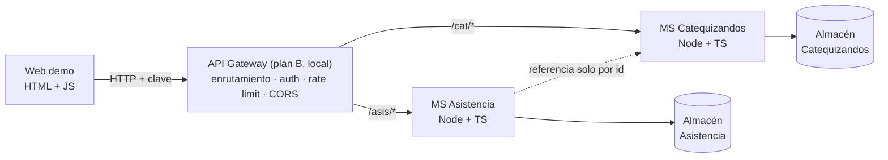
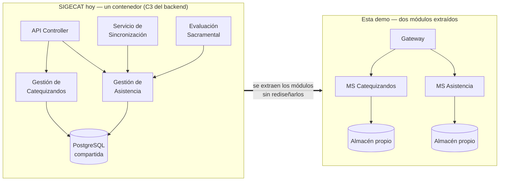

# Arquitectura de la demo — SIGECAT Tarea 2

Este documento explica **qué se construyó, cómo se conecta y por qué así**. La justificación de diseño (SOLID y DDD) está en [`sustentacion.md`](sustentacion.md); el guion para exponer, en [`guion-demo.md`](guion-demo.md).

## 1. Vista general



> **Desviación respecto al SPEC.** El SPEC pide un API Management **en la nube** (Azure APIM, plan B AWS). No hubo acceso a ninguna de las dos cuentas, así que se aplicó el plan B de la sección 8 del SPEC: un **gateway local en contenedor** (`infra/gateway/gateway.js`, rama `paquete-3`) que implementa las mismas características. **No hay APIM ni despliegue en la nube.** El diagrama del SPEC se dibujó con "Azure API Management"; aquí el componente es el gateway local. Ver la sección 5.

**Cómo leerlo.** La flecha punteada de Asistencia a Catequizandos **no es una llamada de red**. Asistencia solo guarda `catequizandoId` y `grupoId` como texto; nunca consulta al otro servicio. Quien junta los dos mundos es la web: pide la lista de niños a Catequizandos y envía el pase de lista a Asistencia.

| Pieza | Responsabilidad | Puerto local |
|---|---|---|
| Web demo | Compone ambas APIs; panel "Probar gateway" | 5500 |
| Gateway | Único punto de entrada: enruta, exige clave, limita, habilita CORS | 8080 |
| MS Catequizandos | Grupos y catequizandos; garantiza el consentimiento informado | 3001 |
| MS Asistencia | Sesiones, registros y señal de riesgo | 3002 |

## 2. Cómo encaja con SIGECAT: de monolito modular a dos servicios

El argumento central de la exposición: **SIGECAT se diseñó como monolito modular con contextos acotados, y esta demo extrae dos de esos módulos como microservicios para probar que la modularidad era correcta.**

El C3 del backend ([`arquitectura-c4.dsl`](diagrams/arquitectura-c4.dsl), contenedor `apiBackend`) ya trae los módulos como componentes separados dentro de **un solo** contenedor: `cmpCatequizandosBack` ("Gestión de Catequizandos") y `cmpAsistenciaSvc` ("Gestión de Asistencia"). La demo toma esos dos componentes y los saca a su propio proceso.



**Por qué esto prueba que la modularidad era correcta.** Si los módulos hubieran estado enredados, extraerlos habría exigido rediseñar el dominio. Aquí se extrajeron con las mismas formas de datos de `modelo.ts` y sin que Asistencia dependa de Catequizandos: la única costura entre ambos es un identificador. Es el camino de las láminas 18 y 19 del curso.

### Lo que la extracción cuesta y la demo no muestra

Decirlo antes de que pregunten es más fuerte que esperar la pregunta:

- **Los consumidores internos pasan a ser remotos.** En el C3, `cmpSyncSvc` y `cmpSacramental` llaman a `cmpAsistenciaSvc`. Con Asistencia fuera, esas llamadas serían por red (latencia, fallos parciales). La demo no incluye a esos consumidores.
- **Base de datos compartida vs. una por servicio.** En el C3 ambos módulos escriben en la misma PostgreSQL. La demo da a cada servicio su propio almacén: es un paso más que la extracción, y trae consistencia eventual (ver [`sustentacion.md`](sustentacion.md), sección DDD).
- **Un servicio ya no puede validar contra el otro.** Asistencia acepta ids de catequizandos que quizá no existan. Es una simplificación declarada, no un descuido.

## 3. Flujo de la demo (secuencia)

```mermaid
sequenceDiagram
  autonumber
  actor U as Catequista
  participant W as Web
  participant G as Gateway
  participant C as MS Catequizandos
  participant A as MS Asistencia

  U->>W: elige grupo, tipo y fecha
  W->>G: GET /cat/grupos  (Ocp-Apim-Subscription-Key)
  G->>C: GET /grupos
  C-->>W: Grupo[]
  W->>G: GET /cat/catequizandos?grupoId=grp-8
  G->>C: GET /catequizandos?grupoId=grp-8
  C-->>W: listado mínimo (sin consentimiento)
  Note over W: todos en "presente"; un toque rota el estado
  U->>W: Guardar
  W->>G: POST /asis/pases-de-lista  (ids con crypto.randomUUID)
  G->>A: POST /pases-de-lista
  A-->>W: 201 {sesionId, registrosGuardados}
  U->>W: Ver riesgo de un niño
  W->>G: GET /asis/catequizandos/cat-007/riesgo
  G->>A: GET /catequizandos/cat-007/riesgo
  A-->>W: SenalRiesgo {nivel: alto, motivos}
```

Ninguna flecha va de un servicio al otro: la web es la única que ve ambas respuestas y las combina.

## 4. Políticas del gateway

Implementadas por el gateway local `infra/gateway/gateway.js` (rama `paquete-3`), que hace el papel del APIM:

| # | Característica | Configuración real | Qué se ve en la demo |
|---|---|---|---|
| 1 | Enrutamiento | `/cat/*` → Catequizandos (`:3001`), `/asis/*` → Asistencia (`:3002`); quita el prefijo y no reenvía la clave | Una sola URL base (`:8080`) para ambos servicios |
| 2 | Clave de suscripción | Cabecera `Ocp-Apim-Subscription-Key`; clave de demo `demo-key` | Llamada sin clave o con clave errónea → **401** |
| 3 | Rate limiting | 30 llamadas por 60 s por clave; responde **429** con `Retry-After`; un 401 no consume cupo | Ráfaga de 40 → **429** |
| 4 | CORS | Origen permitido `http://localhost:5500`; el preflight `OPTIONS` pasa sin clave | Sin esto el navegador bloquea la respuesta |
| 5 | Documentación (opcional) | **No aplica**: no hay portal de APIM donde importar `openapi.yaml` | — |

**Verificación.** `infra/gateway/gateway.test.js` tiene 7 pruebas (enrutamiento, 401, 404, preflight, 429, CORS en 401/429 y no duplicar CORS) y pasan; se ejecutaron contra un **servicio simulado**. Aparte, el paquete 4 probó la web contra los servicios reales pasando por el gateway. **Evidencias** (rama `paquete-3`, `docs/evidencias/`): son **registros de texto**, no capturas de pantalla, generados contra el gateway local delante de las imágenes Docker reales de ambos servicios: `200-con-clave.txt`, `401-sin-clave.txt` y `429-rafaga.txt` (40 llamadas seguidas: 29 respuestas 200 y 11 respuestas 429). No provienen de Azure API Management.

**Referencia sin probar.** `infra/apim/policy.xml` contiene la política de Azure APIM del SPEC (`cors` + `rate-limit`). **No se probó**: no hubo acceso a Azure. Sirve para mostrar cómo se traduciría el gateway local a un APIM real; no debe presentarse como configuración desplegada. La clave de suscripción no es una política de APIM sino una opción del producto (`subscription-required`).

**Regla de CORS.** Los servicios solo agregan cabeceras CORS si `NODE_ENV !== 'production'` (verificado en `main.ts` de ambos). Con el gateway delante, el gateway es la única fuente: descarta las cabeceras `Access-Control-*` que vengan del servicio y pone las suyas, también en las respuestas 401 y 429 para que el navegador pueda leerlas (`infra/gateway/gateway.js`, líneas 105–109). Si ambos las agregaran sin filtrar, el navegador rechazaría la respuesta por cabeceras duplicadas; esa fue una falla real encontrada al integrar y ya está corregida. Aun así, `docker-compose.yml` (servicios solos, para probarlos directo con la web) fija `NODE_ENV: development`, y `infra/docker-compose.gateway.yml` lo sobrescribe a `production` al sumarlo.

## 5. Despliegue

**No hay despliegue en la nube.** No hubo acceso a Azure ni a AWS (sin CLI ni cuenta verificada), y se decidió ir al plan B del SPEC. Todo corre en local con Docker. Hay dos modos:

| | Servicios solos | Con gateway (modo de la demo) |
|---|---|---|
| Comando | `docker compose up --build` | `docker compose -f docker-compose.yml -f infra/docker-compose.gateway.yml up --build` |
| Web | `http://localhost:5500` | `http://localhost:5500` |
| Entrada a las APIs | Directa: `:3001` y `:3002` | Gateway: `http://localhost:8080/cat` y `/asis` |
| `config.js` | `CAT_BASE` y `ASIS_BASE` a `:3001` / `:3002`, `API_KEY` vacía | `CAT_BASE: http://localhost:8080/cat`, `ASIS_BASE: http://localhost:8080/asis`, `API_KEY: demo-key` |
| Clave | No aplica | Cabecera `Ocp-Apim-Subscription-Key: demo-key` |
| CORS | Lo pone cada servicio (`development`) | Lo pone el gateway (servicios en `production`) |

`infra/docker-compose.gateway.yml` depende de que los nombres de servicio (`catequizandos`, `asistencia`) y los puertos (3001, 3002) coincidan con el `docker-compose.yml` de la raíz.

### Qué cumple y qué no del SPEC

| Exigencia | Estado |
|---|---|
| API Gateway con al menos 3 características | ✅ Cumple con un gateway propio: enrutamiento, clave (401), rate limit (429), CORS |
| Web que llama al menos 2 APIs a través del gateway | ✅ Según el paquete 4, la web funciona contra los servicios reales pasando por el gateway (no lo he ejecutado yo) |
| Plataforma de API Management **en la nube** | ❌ **No se cumple.** Es un gateway local, no un servicio administrado |
| Demo funcional + diagrama | Diagrama ✅. Demo: falta un ensayo de punta a punta con `docker compose` completo (servicios + gateway + web) y, si se quiere, capturas de pantalla (las evidencias actuales son texto) |

Hay que decirlo así en la exposición: el gateway local demuestra las **características** que la tarea pide, pero no es una plataforma de API Management en la nube. Si el docente exige la plataforma, `infra/apim/policy.xml` muestra la traducción a Azure, sin probar.

**Diferencias con un APIM real** que conviene tener a mano si preguntan: el gateway guarda el contador de rate limit en memoria de un solo proceso (un APIM lo comparte entre instancias), tiene una sola clave fija (un APIM gestiona suscripciones por producto y por usuario) y no ofrece portal de desarrolladores ni análisis.

Plan B si algo falla en vivo: los registros de 200, 401 y 429 guardados en `docs/evidencias/`.

## 6. Simplificaciones declaradas

- Almacén en memoria con semilla: los datos guardados en la demo se pierden al reiniciar el contenedor.
- El gateway es local y no una plataforma en la nube (ver sección 5).
- La clave del gateway (`demo-key`) está en el frontend (`config.js`) **solo por ser demo**. En producción iría detrás de autenticación de usuario.
- Asistencia no valida que el catequizando exista (otro contexto; consistencia eventual).
- Se excluyen datos de salud y neurodivergencia (`DatosRestringidos`) por minimización, según el ADR 005.
